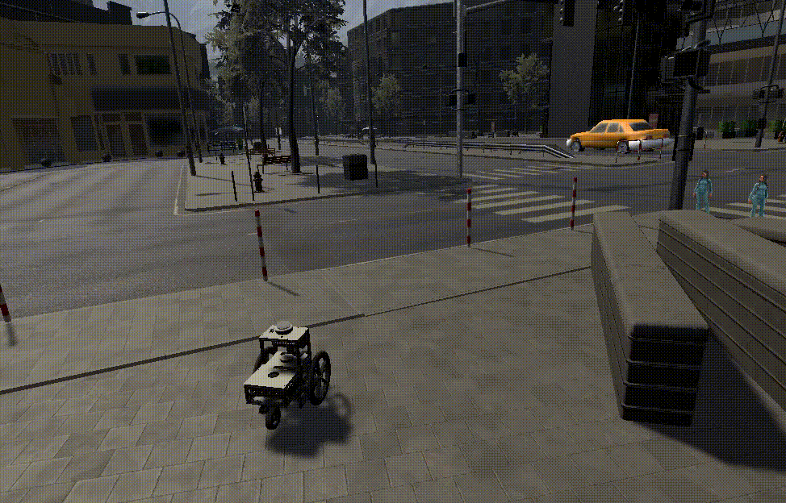

# Robot simulation in city environment

 

[Unit04](https://github.com/Field-Robotics-Japan/unit04_unity) robot model is
integrated into the urban environment based on the
[vtc_unity](https://github.com/Field-Robotics-Japan/vtc_unity) project.

## Installation

Please, follow installation instructions in
[INSTALL.md](docs/INSTALL.md).

## ROS

Unity-ROS communication is established using the [ros-sharp](https://github.com/siemens/ros-sharp)
package.

Build the packages in `ros_ws`:
```bash
cd ./ros_ws
rosdep install --from-paths src --ignore-src -r -y
catkin build
```

Launch `unity_ros` nodelet:

```bash
roslaunch unity_ros unity_ros.launch
```

Open [Windridge City Demo Scene](https://github.com/RuslanAgishev/ImageSynthUnity/blob/f95d701a7f73a3def036f0e7a725ff14d3e947b7/Assets/Scenes/Windridge%20City%20Demo%20Scene.unity)
in Unity and enter the Game mode (press play).
