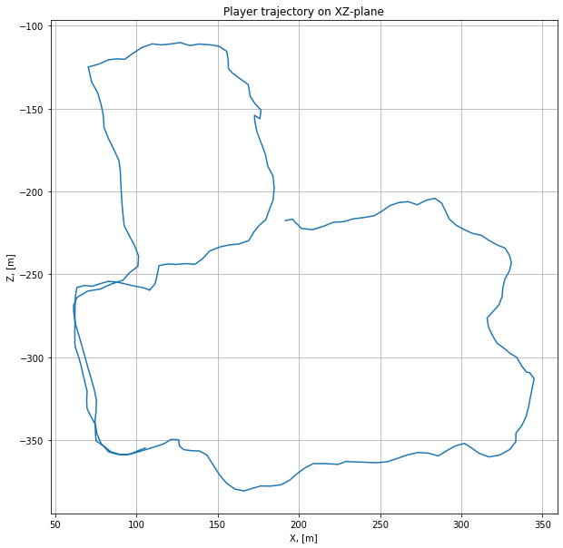

# Synthetic Data collection from Unity3D for Machine Learning

Unity project to collect synthetic data from
[Windridge City](https://assetstore.unity.com/packages/3d/environments/roadways/windridge-city-132222)
environment for CNN training based on the
[ml-imagesynthesis](https://bitbucket.org/Unity-Technologies/ml-imagesynthesis/src/master/) repository.

### Rationale ###
One of the main challenges in Machine Learning is the task of getting large amounts of training data in the right format. Deep learning, and machine learning more generally, needs huge training sets to work properly.

Virtual worlds can provide a wealth of training data. However it must consist of more than just the final image: object categorization, optical flow, etc.

### What does it do? ###
The repository allows to capture image depth, segmentation, optical flow, etc as .png images with minimal intrusion:

* __Image segmentation__ - each object in the scene gets unique color
* __Object categorization__ - objects are assigned color based on their category
* __Optical flow__ - pixels are colored according to their motion in the relation to camera
* __Depth__ - pixels are colored according to their distance from the camera
* __Normals__ - surfaces are colored according to their orientation in relation with the camera
* __3D detection__ - get bounding box, enhancing game object or a group of objects

 
 
 

### Wiki ###
* [How does it work](https://bitbucket.org/Unity-Technologies/ml-imagesynthesis/wiki/Implementation)

### Installation
Please follow installation instruction, provided at
[INSTALL.md](https://github.com/RuslanAgishev/ImageSynthUnity/-/blob/master/INSTALL.md).

### Collect Synthetic Data ###
In order to generate the data described above the
[ImageSynthesis.cs](https://github.com/RuslanAgishev/ImageSynthUnity/-/blob/master/Assets/ImageSynthesis/ImageSynthesis.cs)
script is attached to virtual camera in a Unity Scene.
The [DataRecorder.cs](https://github.com/RuslanAgishev/ImageSynthUnity/-/blob/master/Assets/Scripts/DataRecorder.cs)
script is responsible for capturing the frames and saving data on disk.

### Train a CNN on synthetic data ###
An example of how to train a CNN for semantic segmentation based on the collected synthetic data is provided,
[TrainOnSynthDataFastai.ipynb](https://github.com/RuslanAgishev/ImageSynthUnity/-/blob/master/tools/TrainOnSynthDataFastai.ipynb).
For more information check the [fastai tutorial](https://course.fast.ai/videos/?lesson=3).

Here is an example on how to convert collected synthetic semantic segmentation data to a specific dataset format,
[TransformMasksToMSeg.ipynb](https://github.com/RuslanAgishev/ImageSynthUnity/-/blob/master/tools/TransformMasksToMSeg.ipynb).
In this case objects labels in segmentation masks are transformed to match the
[MSeg](https://github.com/mseg-dataset/mseg-semantic)
dataset format.

### Localization and Odometry data logging ###


[DataRecorder.cs](https://github.com/RuslanAgishev/ImageSynthUnity/-/blob/master/Assets/Scripts/DataRecorder.cs)
script allows you also to record your player or virtual camera localization and odometry information
synchronized with the frames data, including:

* position, `[m]`
* velocity, `[m/sec]`
* acceleration, `[m/sec^2]`
* orientation quaternion, `q = [x,y,z,w]`
* angular velocity, `[deg/sec]`
* angular acceleration, `[deg/sec^2]`

An example of recorded data could look in the following way:

```json
{
    "frame_number": 4,
    "pose_m": "(191.4, 343.3, -217.5)",
    "vel_m_sec": "(0.0, 0.0, 0.0)",
    "acc_m_sec_sec": "(0.0, 0.0, 0.0)",
    "orient_quat": "(0.0, 1.0, 0.1, -0.3)",
    "ang_vel_deg_sec": "(0.0, 5.2, 0.0)",
    "ang_acc_deg_sec_sec": "(140.5, 135.0, 0.0)"
}
```

The file [odometry.json](https://github.com/RuslanAgishev/ImageSynthUnity/-/blob/master/tools/odometry.json)
recorded with the captured frames if Save Frames option of the
[DataRecorder.cs](https://github.com/RuslanAgishev/ImageSynthUnity/-/blob/master/Assets/Scripts/DataRecorder.cs)
is enabled.

Have a look at the
[parse_odometry_and_detections.ipynb](https://github.com/RuslanAgishev/ImageSynthUnity/-/blob/master/tools/parse_odometry_and_detections.ipynb)
example to see how to parse the recorded data.

### 3D Object Detection ###


Generation and drawing bounding boxes around game objects with the help of the
[BoundBoxes](https://assetstore.unity.com/packages/tools/utilities/boundboxes-10962)
Unity asset.

In order to get it work, the
[DrawLines.cs](https://github.com/RuslanAgishev/ImageSynthUnity/-/blob/master/Assets/DimBoxes/BoundBox/DrawLines.cs)
script is attached to camera for bound boxes visualization in Scene and Game views.
Another script,
[BoundBox.cs](https://github.com/RuslanAgishev/ImageSynthUnity/-/blob/master/Assets/DimBoxes/BoundBox/BoundBox.cs)
should be added to each game object (or a group of game objects, like the
[Car asset](https://assetstore.unity.com/packages/3d/vehicles/low-poly-car-149312))
you want to detect.
You can log information about detected objects, like position and orientation relative to camera and
bbox size, using
[calculateBoundsRelativeToCamera](https://github.com/RuslanAgishev/ImageSynthUnity/-/blob/master/Assets/DimBoxes/BoundBox/BoundBox.cs#L122) function.

[DataRecorder.cs](https://github.com/RuslanAgishev/ImageSynthUnity/-/blob/master/Assets/Scripts/DataRecorder.cs)
also allows to record dynamic objects (cars and pedestrians) bounding box data.
Example of a data frame captured at one time moment could look similar to the following:

```json
{
    "frame_number": 13,
    "tags": "TrafficCar, TrafficCar, Pedestrian",
    "poses_m": "(187.3, 341.6, -216.9), (184.1, 341.6, -229.2), (202.4, 341.7, -250.1)",
    "orients_quat": "(0.0, -1.0, 0.0, -0.1), (0.0, 0.9, 0.0, -0.5), (0.0, -1.0, 0.0, -0.1)",
    "bbox_sizes_m": "(2.3, 1.9, 6.0), (2.3, 1.9, 6.0), (1.3, 1.8, 0.3)"
  }
```

Here the `tags` attribute describes the cpatured dynamic objects labels. Their corresponding global (on the map) positions
and orientations are represented by `poses_m` (in meters) and `orients_quat` (as a quaternion).
Bounding boxes sizes are given in `bbox_sizes_m` attribute (also in meters).

Have a look at an example on how to do detections data postprocessing,
[parse_odometry_and_detections.ipynb](https://github.com/RuslanAgishev/ImageSynthUnity/-/blob/master/tools/parse_odometry_and_detections.ipynb).
